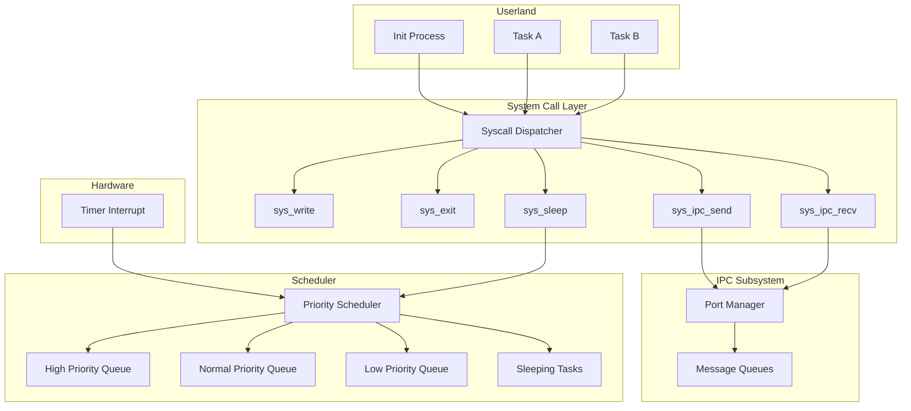

# Design Document: Advanced Scheduling, System Calls, and IPC

## Overview

This document describes the design for Phase 4 of MelloOS kernel development, which extends the existing round-robin scheduler with priority-based scheduling, adds a system call interface for userland-kernel communication, and implements inter-process communication (IPC) through message passing.

The design builds upon the existing scheduler infrastructure (task management, context switching, timer interrupts) and memory management system (heap allocator, paging) to provide:

1. **Priority-Based Scheduling**: Three-level priority system (High/Normal/Low) with preemptive scheduling
2. **Sleep/Wake Mechanism**: Timer-based task suspension and resumption
3. **System Call Interface**: Controlled userland-to-kernel communication via syscall instruction
4. **IPC Message Passing**: Port-based message queuing for inter-task communication
5. **Userland Init Process**: First user-mode process demonstrating syscall and IPC usage

## Architecture

### Component Diagram



### Data Flow Diagrams

#### System Call Flow

```
Userland Task
    |
    | 1. syscall instruction (int 0x80)
    v
Syscall Entry Point (ASM)
    |
    | 2. Save registers, switch to kernel stack
    v
Syscall Dispatcher
    |
    | 3. Validate syscall ID and arguments
    v
Syscall Handler (sys_write, sys_sleep, etc.)
    |
    | 4. Execute kernel operation
    v
Syscall Return (ASM)
    |
    | 5. Restore registers, return to userland
    v
Userland Task (continues)
```

#### IPC Message Passing Flow

```
Sender Task                    Port Manager                    Receiver Task
    |                               |                               |
    | ipc_send(port, msg)           |                               |
    |------------------------------>|                               |
    |                               | Enqueue message               |
    |                               | to port queue                 |
    |                               |                               |
    |                               | Check if receiver             |
    |                               | is blocked on port            |
    |                               |                               |
    |                               | Wake receiver                 |
    |                               |------------------------------>|
    |                               |                               | Dequeue message
    |                               |                               | Copy to buffer
    |                               |                               | Return to userland
```

#### Priority Scheduling Flow

```
Timer Interrupt
    |
    v
Scheduler Tick
    |
    | 1. Update sleeping tasks
    | 2. Wake tasks whose sleep time elapsed
    v
Select Next Task
    |
    | Priority order: High > Normal > Low
    | Within same priority: Round-robin
    v
Context Switch
    |
    v
Selected Task Runs
```

## Components and Interfaces

### 1. Priority Scheduler (`kernel/src/sched/priority.rs`)

#### Data Structures

```rust
/// Task priority levels
#[derive(Copy, Clone, PartialEq, Eq, PartialOrd, Ord, Debug)]
pub enum TaskPriority {
    Low = 0,
    Normal = 1,
    High = 2,
}

/// Sleeping task entry
struct SleepingTask {
    task_id: TaskId,
    wake_tick: u64,
}

/// Priority scheduler state
pub struct PriorityScheduler {
    /// Ready queues for each priority level
    ready_queues: [TaskQueue; 3],
    
    /// Min-heap of sleeping tasks sorted by wake_tick (O(log n) wake operations)
    /// Future optimization: Use BinaryHeap for efficient wake_tick ordering
    sleeping_tasks: Vec<SleepingTask>,
    
    /// Current tick count (u64 wraps in ~584 million years at 1kHz)
    current_tick: u64,
    
    /// Preemption disable counter (0 = preemption enabled)
    preempt_disable_count: usize,
    
    /// Bitmap tracking non-empty queues for O(1) selection
    non_empty_queues: u8,  // Bits 0-2 for Low/Normal/High
}
```

#### Scheduling Parameters

- **Timer Frequency**: 100 Hz (PIT configured for 100 interrupts per second)
- **Time Quantum**: 10 ticks per task (at 100 Hz = 100ms per quantum)
- **Preemption**: Enabled by default, can be disabled in critical sections via `preempt_disable()`
- **Wake Policy**: O(n) linear scan in Phase 4, O(log n) with BinaryHeap in Phase 5
- **Sleeping Tasks Data Structure**: Vec in Phase 4 (simple), BinaryHeap in Phase 5 (efficient)
  - API designed to support O(log n) insert/wake operations
  - Invariant: Data structure must maintain wake_tick ordering
- **Multi-Core**: Single global ready queue in Phase 4, per-CPU queues + work stealing in Phase 7

#### Key Functions

```rust
impl PriorityScheduler {
    /// Add task to appropriate priority queue
    pub fn enqueue_task(&mut self, task_id: TaskId, priority: TaskPriority);
    
    /// Select next task to run (highest priority first, O(1) with bitmap)
    pub fn select_next(&mut self) -> Option<TaskId>;
    
    /// Put task to sleep for specified ticks
    pub fn sleep_task(&mut self, task_id: TaskId, ticks: u64);
    
    /// Wake tasks whose sleep time has elapsed (O(n) in Phase 4)
    pub fn wake_sleeping_tasks(&mut self);
    
    /// Update tick counter and wake tasks
    pub fn tick(&mut self);
    
    /// Disable preemption (for critical sections)
    pub fn preempt_disable(&mut self);
    
    /// Enable preemption
    pub fn preempt_enable(&mut self);
    
    /// Check if preemption is allowed
    pub fn can_preempt(&self) -> bool;
}
```

#### Integration with Existing Scheduler

The priority scheduler will replace the current single `TaskQueue` in `sched/mod.rs`:

- Modify `SchedState` to use `PriorityScheduler` instead of single `runqueue`
- Update `schedule_next()` to use priority-based selection
- Integrate `wake_sleeping_tasks()` into timer interrupt handler

### 2. System Call Interface (`kernel/src/sys/syscall.rs`)

#### Syscall Entry Point

```rust
/// Syscall entry point (naked function)
/// Saves registers and calls dispatcher
#[naked]
#[no_mangle]
pub unsafe extern "C" fn syscall_entry() {
    // Assembly code to:
    // 1. Save all registers (RAX, RBX, RCX, RDX, RSI, RDI, R8-R15)
    // 2. Clear direction flag (DF = 0)
    // 3. Sanitize RFLAGS (preserve IF for interrupts)
    // 4. Switch to kernel stack (if needed in Phase 5)
    // 5. Call syscall_dispatcher
    // 6. Restore registers
    // 7. Return to userland (iretq for int 0x80)
}
```

#### Syscall ABI (x86-64 System V Calling Convention)

**Register Mapping**:
- `RAX`: Syscall number (input), return value (output)
- `RDI`: Argument 1
- `RSI`: Argument 2
- `RDX`: Argument 3
- `RCX`, `R8-R11`: Caller-saved (clobbered)
- `RBX`, `RBP`, `R12-R15`: Callee-saved (preserved)

**Return Values**:
- Success: Non-negative value (0, bytes written, bytes received, etc.)
- Error: -1

**State Boundary**:
- Unsafe zone: Between `int 0x80` and syscall_entry completion
- Safe zone: After register save, before register restore
- Critical: Clear DF flag, sanitize RFLAGS.IF

#### Syscall Dispatcher

```rust
/// Syscall numbers
pub const SYS_WRITE: usize = 0;
pub const SYS_EXIT: usize = 1;
pub const SYS_SLEEP: usize = 2;
pub const SYS_IPC_SEND: usize = 3;
pub const SYS_IPC_RECV: usize = 4;

/// Syscall dispatcher
/// Validates syscall ID and dispatches to appropriate handler
pub fn syscall_dispatcher(
    syscall_id: usize,
    arg1: usize,
    arg2: usize,
    arg3: usize,
) -> isize {
    match syscall_id {
        SYS_WRITE => sys_write(arg1, arg2, arg3),
        SYS_EXIT => sys_exit(arg1),
        SYS_SLEEP => sys_sleep(arg1),
        SYS_IPC_SEND => sys_ipc_send(arg1, arg2, arg3),
        SYS_IPC_RECV => sys_ipc_recv(arg1, arg2, arg3),
        _ => -1, // Invalid syscall
    }
}
```

#### Syscall Handlers

```rust
/// Write data to serial output
fn sys_write(fd: usize, buf_ptr: usize, len: usize) -> isize;

/// Terminate current task
fn sys_exit(code: usize) -> !;

/// Sleep for specified ticks
fn sys_sleep(ticks: usize) -> isize;

/// Send message to port
fn sys_ipc_send(port_id: usize, buf_ptr: usize, len: usize) -> isize;

/// Receive message from port (blocking)
fn sys_ipc_recv(port_id: usize, buf_ptr: usize, len: usize) -> isize;
```

#### Syscall Setup

The syscall interface will be configured during kernel initialization:

1. **Using `int 0x80` (x86 legacy)** - Phase 4 Implementation:
   - Register interrupt handler in IDT at vector 0x80
   - IDT gate type: Interrupt Gate (type 0xE)
   - DPL (Descriptor Privilege Level): 3 (user-accessible)
   - Present bit: 1
   - IST (Interrupt Stack Table): 0 (use current stack)
   - Handler saves registers and calls dispatcher
   - Overhead: ~100-200 cycles

2. **Using `syscall` instruction (x86-64 preferred)** - Phase 5 Optimization:
   - Configure MSRs (STAR, LSTAR, SFMASK)
   - LSTAR points to `syscall_entry`
   - Faster than interrupt-based approach
   - Overhead: ~50-100 cycles

For Phase 4, we'll use `int 0x80` for simplicity, with `syscall` instruction as a future optimization.

### 3. IPC Subsystem (`kernel/src/sys/ipc.rs`, `kernel/src/sys/port.rs`)

#### Data Structures

```rust
/// Message structure
pub struct Message {
    data: Vec<u8>,  // Max 4096 bytes per message
}

/// Port structure
pub struct Port {
    id: usize,
    queue: VecDeque<Message>,  // Max 16 messages
    blocked_tasks: VecDeque<TaskId>,  // FIFO wake policy
    lock: Spinlock<()>,
}

/// Port manager
pub struct PortManager {
    ports: [Option<Port>; 256],
    table_lock: Spinlock<()>,  // Protects port creation/deletion
}
```

#### IPC Semantics

- **Wake Policy**: Wake one task (FIFO) to prevent thundering herd
- **Message Size Limit**: 4096 bytes (enforced in `send_message`)
- **Port Lifecycle**: Static system ports (0-255) created at boot
- **Zero-Copy**: Not implemented in Phase 4, planned for Phase 6 with shared memory
- **Allocation Context**: IPC operations only in process context, never in IRQ handlers

#### Key Functions

```rust
impl PortManager {
    /// Create a new port (called during boot for system ports)
    pub fn create_port(&mut self, port_id: usize) -> Result<(), IpcError>;
    
    /// Send message to port (validates size <= 4096 bytes)
    pub fn send_message(
        &mut self,
        port_id: usize,
        data: &[u8],
    ) -> Result<(), IpcError>;
    
    /// Receive message from port (blocking, wakes one task FIFO)
    pub fn recv_message(
        &mut self,
        port_id: usize,
        task_id: TaskId,
        buf: &mut [u8],
    ) -> Result<usize, IpcError>;
    
    /// Receive message with timeout (future-proof API for Phase 6)
    /// Not implemented in Phase 4, returns Err(IpcError::NotImplemented)
    pub fn recv_message_timeout(
        &mut self,
        port_id: usize,
        task_id: TaskId,
        buf: &mut [u8],
        timeout_ticks: u64,
    ) -> Result<usize, IpcError>;
    
    /// Wake one blocked task on port (FIFO policy)
    fn wake_one_blocked_task(&mut self, port_id: usize);
}
```

#### Synchronization and Locking

**Lock Hierarchy** (to prevent deadlock):
1. `PortManager::table_lock` (for port creation/deletion)
2. `Port::lock` (for queue operations)
3. Scheduler lock (for task state changes)

**Lock Order Rule**: Always acquire locks in the order above. Never hold Port lock while acquiring Scheduler lock.

**Preemption and Locking**:
- When acquiring `Port::lock`, call `preempt_disable()` first
- When releasing `Port::lock`, call `preempt_enable()` after
- This prevents context switch while holding spinlock (avoids deadlock)
- Scheduler must never call allocator while preemption is disabled

**Concurrency Invariants**:
- **IPC operations only in process context** (syscall handlers), never in IRQ handlers
- **ISR behavior**: Timer interrupt only sets flags and pends reschedule, no IPC operations
- No memory allocation while holding Port lock
- No nested IPC calls (prevents reentrancy issues)
- Each `Port` has a `Spinlock` to protect queue operations
- `send_message` acquires port lock, enqueues message, wakes one blocked task (FIFO)
- `recv_message` acquires port lock, dequeues message or blocks task
- Blocking is implemented by marking task as `Blocked` and removing from ready queue

### 4. Task Extensions (`kernel/src/sched/task.rs`)

#### Extended Task State

```rust
#[derive(Debug, Clone, Copy, PartialEq, Eq)]
pub enum TaskState {
    Ready,
    Running,
    Sleeping,
    Blocked,  // NEW: Blocked on IPC
}
```

#### Extended Task Structure

```rust
pub struct Task {
    // Existing fields...
    pub id: TaskId,
    pub name: &'static str,
    pub stack: *mut u8,
    pub stack_size: usize,
    pub state: TaskState,
    pub context: CpuContext,
    
    // NEW fields for Phase 4
    pub priority: TaskPriority,
    pub wake_tick: Option<u64>,
    pub blocked_on_port: Option<usize>,
}
```

### 5. Userland Init Process (`kernel/userspace/init/main.rs`)

#### Structure

```rust
#![no_std]
#![no_main]

// Syscall wrappers
fn syscall(id: usize, arg1: usize, arg2: usize, arg3: usize) -> isize;

fn sys_write(msg: &str) {
    unsafe {
        syscall(0, 0, msg.as_ptr() as usize, msg.len());
    }
}

fn sys_sleep(ticks: usize) {
    unsafe {
        syscall(2, ticks, 0, 0);
    }
}

fn sys_ipc_send(port: usize, data: &[u8]) -> isize {
    unsafe {
        syscall(3, port, data.as_ptr() as usize, data.len())
    }
}

fn sys_ipc_recv(port: usize, buf: &mut [u8]) -> isize {
    unsafe {
        syscall(4, port, buf.as_mut_ptr() as usize, buf.len())
    }
}

#[no_mangle]
pub extern "C" fn _start() -> ! {
    sys_write("Hello from userland! ✨");
    
    // Demonstrate IPC
    sys_ipc_send(2, b"ping");
    
    let mut buf = [0u8; 4];
    sys_ipc_recv(1, &mut buf);
    
    sys_write("Got reply: pong");
    
    // Sleep demo
    sys_sleep(100);
    
    sys_write("Woke up!");
    
    loop {
        sys_sleep(1000);
    }
}
```

#### Compilation and Loading

The init process will be:
1. Compiled as a separate binary with `#![no_std]`
2. Linked at a fixed address (e.g., 0x400000)
3. Embedded into kernel image or loaded from disk
4. Mapped into virtual memory with user-mode permissions
5. Launched by kernel after boot

For Phase 4 simplification, we'll embed the init binary into the kernel image.

## Data Models

### Task Priority Queue

```
High Priority Queue:    [Task 5] -> [Task 8] -> NULL
Normal Priority Queue:  [Task 1] -> [Task 2] -> [Task 3] -> NULL
Low Priority Queue:     [Task 4] -> [Task 6] -> NULL
```

### Sleeping Tasks List

```
Sleeping Tasks (sorted by wake_tick):
[
    { task_id: 3, wake_tick: 1050 },
    { task_id: 7, wake_tick: 1200 },
    { task_id: 2, wake_tick: 1500 },
]
```

### Port Message Queue

```
Port 1:
    Queue: [Message("hello")] -> [Message("world")] -> NULL
    Blocked Tasks: [Task 4, Task 6]
    
Port 2:
    Queue: NULL
    Blocked Tasks: [Task 3]
```

## Error Handling

### Syscall Errors

All syscalls return `isize`:
- **Success**: Non-negative value (0, bytes written, bytes received, etc.)
- **Error**: -1

Error conditions:
- **Invalid syscall ID**: Return -1
- **Invalid pointer**: Return -1 (Phase 4: no validation, Phase 5: validate user pointers)
- **Invalid port ID**: Return -1
- **Queue full**: Return -1
- **Message too large**: Return -1 (> 4096 bytes)
- **Invalid arguments**: Return -1

**Note**: SYS_IPC_RECV returns bytes received on success (>= 0), or -1 on error.

### IPC Errors

```rust
pub enum IpcError {
    InvalidPort,
    QueueFull,
    InvalidBuffer,
    PortNotFound,
    MessageTooLarge,  // > 4096 bytes
    NotImplemented,   // For future APIs like recv_timeout
}
```

### Scheduler Errors

Existing `SchedulerError` enum will be extended:

```rust
pub enum SchedulerError {
    OutOfMemory,
    TooManyTasks,
    InvalidTaskId,
    RunqueueFull,
    InvalidPriority,  // NEW
}
```

## Testing Strategy

### Unit Tests

1. **Priority Scheduler Tests**
   - Test priority queue ordering
   - Test round-robin within same priority
   - Test sleep/wake functionality
   - Test tick counter updates

2. **Syscall Tests**
   - Test syscall dispatcher routing
   - Test argument validation
   - Test return value handling

3. **IPC Tests**
   - Test message enqueue/dequeue
   - Test port creation
   - Test blocking/waking tasks
   - Test queue overflow handling

### Integration Tests

1. **Priority Scheduling Integration**
   - Spawn 3 tasks with different priorities
   - Verify High runs before Normal runs before Low
   - Verify round-robin within same priority

2. **Sleep/Wake Integration**
   - Task sleeps for N ticks
   - Verify task is removed from ready queue
   - Verify task wakes after N ticks
   - Verify task is added back to ready queue

3. **Syscall Integration**
   - Userland task invokes sys_write
   - Verify output appears on serial
   - Userland task invokes sys_sleep
   - Verify task sleeps and wakes

4. **IPC Integration**
   - Task A sends message to port 1
   - Task B receives message from port 1
   - Verify message content matches
   - Test blocking when no messages available

### Stress and Concurrency Tests

1. **IPC Stress Test**
   - Ping-pong 10,000 messages between two tasks
   - Random sleep/jitter between sends
   - Verify no message loss or corruption
   - Test queue-full condition (send 17 messages to trigger overflow)

2. **Concurrency Test Patterns**
   - N senders → 1 receiver (fan-in)
   - 1 sender → N receivers (fan-out)
   - Interleaved sleep/recv/send operations
   - Verify FIFO wake order

3. **Priority Starvation Test** (Known Limitation)
   - Spawn continuous High priority task
   - Verify Low priority task eventually runs (will fail without aging)
   - Document as known limitation for Phase 4
   - Plan priority aging for Phase 7

### Observability and Metrics

**Log Levels**:
- `TRACE`: Detailed syscall arguments, IPC message contents
- `DEBUG`: Task state transitions, queue operations
- `INFO`: Major events (task spawn, syscall invocation, IPC send/recv)
- `ERROR`: Failures (invalid syscall, queue full, etc.)

**Minimum Required Counters** (initialized at boot, logged periodically):
- `ctx_switches`: Total context switches
- `preemptions`: Preemptive context switches (vs voluntary)
- `syscall_count[5]`: Per-syscall invocation counts (indexed by syscall ID)
- `ipc_sends`: Total IPC send operations
- `ipc_recvs`: Total IPC receive operations
- `ipc_queue_full`: Queue full occurrences
- `sleep_count`: Tasks put to sleep
- `wake_count`: Tasks woken from sleep
- `timer_ticks`: Total timer interrupts

**Counter Access**:
```rust
pub struct KernelMetrics {
    pub ctx_switches: AtomicUsize,
    pub preemptions: AtomicUsize,
    pub syscall_count: [AtomicUsize; 5],
    pub ipc_sends: AtomicUsize,
    pub ipc_recvs: AtomicUsize,
    pub ipc_queue_full: AtomicUsize,
    pub sleep_count: AtomicUsize,
    pub wake_count: AtomicUsize,
    pub timer_ticks: AtomicUsize,
}

pub static METRICS: KernelMetrics = KernelMetrics::new();
```

### End-to-End Tests

1. **Full System Test**
   - Boot kernel
   - Launch init process
   - Init sends IPC message
   - Init receives IPC reply
   - Init sleeps
   - Init wakes and continues
   - Verify all operations logged correctly

## Security Considerations

### Phase 4 Limitations

Phase 4 implements a **simplified userland model** without full isolation:

- Tasks run with kernel privileges (Ring 0)
- No separate user/kernel stacks
- No memory protection between tasks
- **No pointer validation in syscalls** - Phase 4 treats all pointers as kernel-trusted
  - Invariant: "Userland pointers are assumed valid and kernel-accessible"
  - Phase 5 will require `copy_from_user()` / `copy_to_user()` for safe pointer access
  - Risk: Malicious or buggy userland can crash kernel with invalid pointers

This is acceptable for Phase 4 as a proof-of-concept, but **Phase 5 must address**:

- User mode (Ring 3) execution
- Separate user/kernel stacks
- Page-level memory protection (user pages marked as user-accessible)
- Syscall pointer validation with `copy_from_user()` / `copy_to_user()`
- SMEP/SMAP support (Supervisor Mode Execution/Access Prevention)

### Current Security Measures

- Syscall ID validation prevents jumping to arbitrary kernel code
- IPC port limits prevent resource exhaustion
- Message queue limits prevent memory exhaustion
- Spinlocks prevent race conditions in IPC

## Performance Considerations

### Priority Scheduler

- **Time Complexity**: O(1) for enqueue, O(1) for select_next (check 3 queues)
- **Space Complexity**: O(N) where N is number of tasks
- **Optimization**: Use bitmap to track non-empty queues

### IPC Message Passing

- **Time Complexity**: O(1) for send, O(1) for receive
- **Space Complexity**: O(M * Q) where M is max messages per port, Q is number of ports
- **Optimization**: Pre-allocate message buffers to avoid allocation overhead

### Syscall Overhead

- **int 0x80**: ~100-200 cycles (interrupt overhead)
- **syscall instruction**: ~50-100 cycles (faster, no interrupt)
- **Future optimization**: Use `syscall` instruction instead of `int 0x80`

## Future Enhancements

### Phase 5: Full User/Kernel Separation

- Implement Ring 3 user mode
- Separate user/kernel stacks
- Page-level memory protection
- Syscall pointer validation

### Phase 6: Advanced IPC

- Shared memory IPC
- Semaphores and mutexes
- Condition variables
- Message priorities

### Phase 7: Advanced Scheduling

- Multi-Level Feedback Queue (MLFQ)
- Priority aging to prevent starvation
- CPU affinity for multi-core
- Real-time scheduling classes

## Implementation Notes

### Build System Changes

Update `kernel/Cargo.toml`:

```toml
[dependencies]
spin = "0.9"
x86_64 = "0.14"
limine = "0.1"

# Enable alloc for Vec, VecDeque in IPC
[dependencies.alloc]
# Note: alloc is part of core, no external dependency needed

[workspace]
members = ["userspace/init"]
```

**Memory Allocation Invariants**:
- No allocation in IRQ context (timer interrupt handler)
- IPC message allocation only in process context (syscall handlers)
- Consider slab allocator for Message structs in Phase 6 to reduce fragmentation

Create `kernel/userspace/init/Cargo.toml`:

```toml
[package]
name = "init"
version = "0.1.0"
edition = "2021"

[dependencies]

[profile.release]
panic = "abort"
lto = true
opt-level = "z"  # Optimize for size
```

### Linker Script Updates

No changes needed to `kernel/linker.ld` for Phase 4, as init process will be embedded in kernel image.

### Makefile Updates

Add targets for building userspace init:

```makefile
.PHONY: userspace
userspace:
	cd kernel/userspace/init && cargo build --release
	
.PHONY: kernel
kernel: userspace
	cd kernel && cargo build --release
```

## Verification Criteria

Phase 4 is complete when:

1. ✅ Kernel supports 3 priority levels (High/Normal/Low)
2. ✅ Higher priority tasks preempt lower priority tasks
3. ✅ Tasks can sleep for specified ticks and wake automatically
4. ✅ Syscall interface works (int 0x80 or syscall instruction)
5. ✅ All 5 syscalls implemented (write, exit, sleep, ipc_send, ipc_recv)
6. ✅ IPC message passing works between tasks
7. ✅ Port-based message queuing works
8. ✅ Blocking receive works (task blocks until message arrives)
9. ✅ Init process runs in userland and uses syscalls
10. ✅ All operations logged to serial for debugging

Expected QEMU output:

```
[KERNEL] MelloOS starting...
[MM] Initializing memory management...
[MM] Total memory: 8192 MB
[SCHED] Initializing scheduler...
[SCHED] Created idle task (id 0)
[SYS] Initializing syscall interface...
[SYS] Syscall handler registered at vector 0x80
[IPC] Initializing IPC subsystem...
[IPC] Created 256 ports
[KERNEL] Spawning init process...
[SCHED] Spawned task 1: init (priority: Normal)
[TIMER] Initializing timer interrupt...
[KERNEL] Boot complete!
[SYSCALL] Task 1: sys_write("Hello from userland! ✨")
[IPC] Task 1 → Port 2: "ping" (4 bytes)
[IPC] Task 1 blocked on Port 1 (waiting for message)
[SCHED] Task 1 → Blocked
[IPC] Task 2 → Port 1: "pong" (4 bytes)
[IPC] Waking Task 1 (message available on Port 1)
[SCHED] Task 1 → Ready
[SYSCALL] Task 1: sys_write("Got reply: pong")
[SYSCALL] Task 1: sys_sleep(100)
[SCHED] Task 1 → Sleeping (wake at tick 100)
[SCHED] Tick 100: Waking Task 1
[SCHED] Task 1 → Ready
[SYSCALL] Task 1: sys_write("Woke up!")
```
