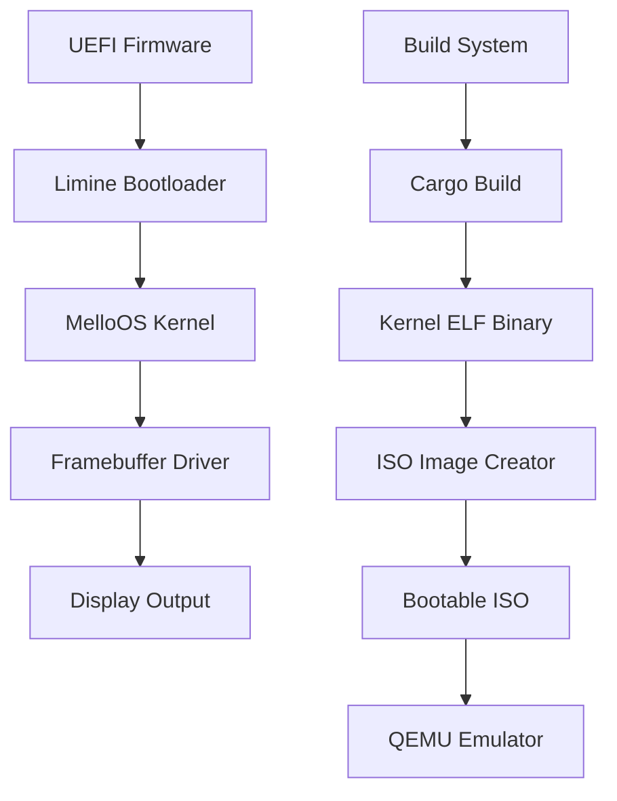
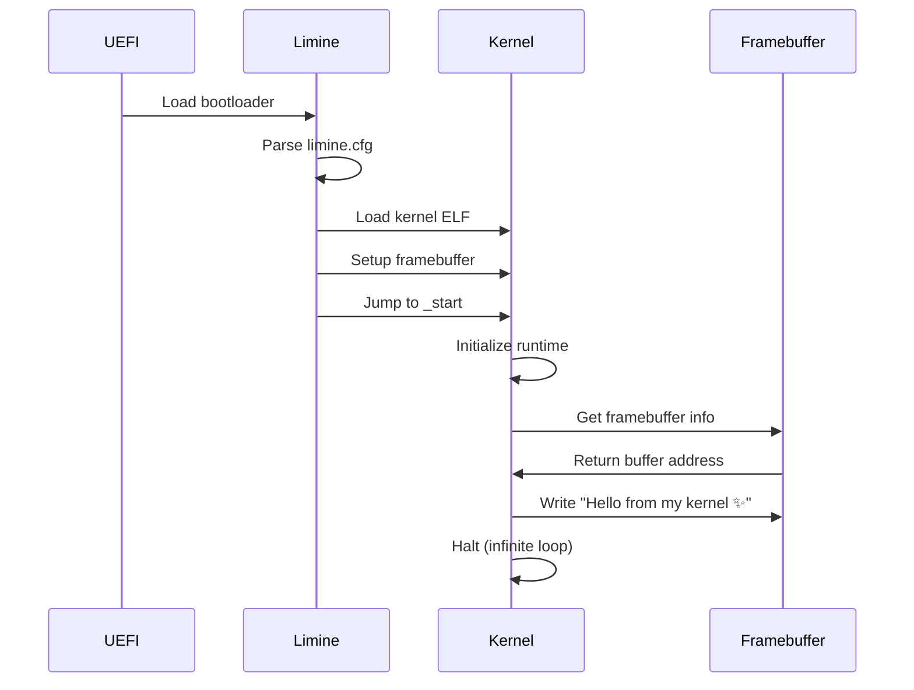

# MelloOS Kernel Design Document

## Overview

MelloOS Kernel เป็น bare-metal operating system kernel ที่เขียนด้วยภาษา Rust โดยใช้ `no_std` environment เพื่อทำงานโดยไม่ต้องพึ่งพา standard library ของ Rust Kernel นี้ออกแบบให้บูตผ่าน UEFI firmware โดยใช้ Limine bootloader ซึ่งเป็น modern bootloader ที่รองรับ multiboot2 protocol และ UEFI

การออกแบบเน้นความเรียบง่าย modularity และความปลอดภัยที่ Rust มอบให้ โดยในเฟสแรกจะมุ่งเน้นการสร้าง minimal kernel ที่สามารถบูตและแสดงข้อความบนหน้าจอได้

## Architecture

### System Architecture



### Boot Process Flow



### Directory Structure

```
mellos/
├── .cargo/
│   └── config.toml          # Cargo build configuration
├── kernel/
│   ├── Cargo.toml           # Kernel dependencies
│   └── src/
│       ├── main.rs          # Kernel entry point
│       ├── framebuffer.rs   # Framebuffer driver
│       └── panic.rs         # Panic handler
├── boot/
│   └── limine.cfg           # Bootloader configuration
├── tools/
│   └── qemu.sh              # QEMU launch script
├── Makefile                 # Build automation
└── README.md                # Documentation
```

## Components and Interfaces

### 1. Kernel Entry Point (`kernel/src/main.rs`)

**Purpose:** จุดเริ่มต้นของ kernel ที่ bootloader จะเรียกใช้

**Key Features:**
- ใช้ `#![no_std]` และ `#![no_main]` เพื่อทำงานแบบ bare-metal
- กำหนด `_start` function เป็น entry point
- รับ Limine boot information structure
- เรียกใช้ framebuffer driver เพื่อแสดงข้อความ
- เข้าสู่ infinite loop เพื่อป้องกัน kernel จาก return

**Interface:**
```rust
#![no_std]
#![no_main]

#[no_mangle]
pub extern "C" fn _start() -> ! {
    // Initialize kernel
    // Get framebuffer from Limine
    // Display message
    // Halt
}
```

### 2. Framebuffer Driver (`kernel/src/framebuffer.rs`)

**Purpose:** จัดการการแสดงผลบนหน้าจอผ่าน framebuffer ที่ bootloader จัดเตรียมไว้

**Key Features:**
- รับ framebuffer information จาก Limine protocol
- วาดข้อความโดยใช้ bitmap font หรือ simple pixel manipulation
- รองรับ RGB color format
- จัดการ memory-mapped I/O อย่างปลอดภัย

**Interface:**
```rust
pub struct Framebuffer {
    address: *mut u8,
    width: usize,
    height: usize,
    pitch: usize,
    bpp: u16,
}

impl Framebuffer {
    pub fn new(limine_fb: &LimineFramebuffer) -> Self;
    pub fn write_string(&mut self, text: &str, x: usize, y: usize);
    pub fn clear(&mut self, color: u32);
    pub fn put_pixel(&mut self, x: usize, y: usize, color: u32);
}
```

### 3. Panic Handler (`kernel/src/panic.rs`)

**Purpose:** จัดการ panic ใน no_std environment

**Key Features:**
- กำหนด custom panic handler ด้วย `#[panic_handler]`
- แสดงข้อความ panic บน framebuffer (ถ้าเป็นไปได้)
- Halt CPU อย่างปลอดภัย

**Interface:**
```rust
#[panic_handler]
fn panic(_info: &core::panic::PanicInfo) -> ! {
    // Display panic message
    // Halt forever
}
```

### 4. Limine Protocol Integration

**Purpose:** ใช้ Limine protocol เพื่อรับข้อมูลจาก bootloader

**Key Features:**
- ใช้ `limine` crate สำหรับ Rust bindings
- ร้องขอ framebuffer request
- ร้องขอ memory map (สำหรับอนาคต)
- ร้องขอ RSDP (สำหรับอนาคต)

**Interface:**
```rust
use limine::*;

#[used]
#[link_section = ".requests"]
static FRAMEBUFFER_REQUEST: LimineFramebufferRequest = 
    LimineFramebufferRequest::new(0);
```

## Data Models

### Framebuffer Structure

```rust
pub struct Framebuffer {
    /// Pointer to framebuffer memory
    address: *mut u8,
    
    /// Screen width in pixels
    width: usize,
    
    /// Screen height in pixels
    height: usize,
    
    /// Bytes per scanline (may include padding)
    pitch: usize,
    
    /// Bits per pixel (typically 32 for RGBA)
    bpp: u16,
}
```

### Color Representation

```rust
pub struct Color {
    r: u8,
    g: u8,
    b: u8,
    a: u8,
}

impl Color {
    pub const fn rgb(r: u8, g: u8, b: u8) -> u32 {
        ((r as u32) << 16) | ((g as u32) << 8) | (b as u32)
    }
}
```

## Build System Design

### Cargo Configuration (`.cargo/config.toml`)

```toml
[build]
target = "x86_64-unknown-none"

[target.x86_64-unknown-none]
rustflags = [
    "-C", "code-model=kernel",
    "-C", "relocation-model=static",
]
```

**Rationale:**
- `x86_64-unknown-none`: Target สำหรับ bare-metal x86_64
- `code-model=kernel`: เหมาะสำหรับ kernel code
- `relocation-model=static`: ไม่ต้องการ dynamic linking

### Makefile Workflow

```makefile
# Build kernel
build:
    cargo build --release
    
# Create ISO image
iso: build
    # Copy kernel to ISO directory
    # Download Limine bootloader
    # Create ISO with xorriso
    
# Run in QEMU
run: iso
    ./tools/qemu.sh
    
# Clean build artifacts
clean:
    cargo clean
    rm -rf iso_root/ *.iso
```

### ISO Creation Process

1. สร้าง directory structure สำหรับ ISO
2. คัดลอก kernel binary ไปยัง `/boot/kernel.elf`
3. คัดลอก Limine bootloader files
4. คัดลอก `limine.cfg` configuration
5. ใช้ `xorriso` สร้าง ISO image
6. ติดตั้ง Limine bootloader ลงใน ISO

## Bootloader Configuration

### limine.cfg Structure

```
TIMEOUT=3

:MelloOS
PROTOCOL=limine
KERNEL_PATH=boot:///boot/kernel.elf
```

**Configuration Options:**
- `TIMEOUT`: เวลารอก่อนบูต (วินาที)
- `PROTOCOL`: ใช้ Limine protocol
- `KERNEL_PATH`: path ไปยัง kernel binary ใน ISO

## QEMU Configuration

### qemu.sh Script Design

```bash
#!/bin/bash

qemu-system-x86_64 \
    -M q35 \
    -m 2G \
    -cdrom mellos.iso \
    -boot d \
    -serial stdio \
    -bios /usr/share/ovmf/OVMF.fd
```

**Parameters:**
- `-M q35`: ใช้ modern chipset
- `-m 2G`: จัดสรร 2GB RAM
- `-cdrom mellos.iso`: โหลด ISO image
- `-boot d`: บูตจาก CD-ROM
- `-serial stdio`: redirect serial output
- `-bios OVMF.fd`: ใช้ UEFI firmware

## Error Handling

### Panic Handling Strategy

1. **Compile-time Safety:** ใช้ Rust type system เพื่อป้องกัน errors
2. **Runtime Panics:** จัดการด้วย custom panic handler
3. **Graceful Degradation:** แสดงข้อความ error แล้ว halt

### Error Scenarios

| Scenario | Handling |
|----------|----------|
| Framebuffer not available | Panic with message |
| Invalid memory access | CPU exception (future work) |
| Bootloader protocol mismatch | Fail to boot |

## Testing Strategy

### Development Testing

1. **QEMU Testing:**
   - รัน kernel ใน QEMU emulator
   - ตรวจสอบ output บนหน้าจอ
   - ใช้ QEMU monitor สำหรับ debugging

2. **Serial Output:**
   - เพิ่ม serial port driver (future)
   - Log messages ไปยัง serial console
   - ใช้สำหรับ debugging เมื่อ framebuffer ไม่พร้อม

3. **Build Verification:**
   - ตรวจสอบว่า kernel binary ถูกสร้างสำเร็จ
   - ตรวจสอบขนาดของ binary
   - ตรวจสอบว่า ISO image สามารถสร้างได้

### Success Criteria

- [ ] Kernel บูตสำเร็จใน QEMU
- [ ] แสดงข้อความ "Hello from my kernel ✨" บนหน้าจอ
- [ ] ไม่มี panic หรือ crash
- [ ] Build process ทำงานอัตโนมัติ
- [ ] Documentation ครบถ้วน

## Performance Considerations

### Boot Time
- Minimal kernel ควรบูตภายใน 1-2 วินาที
- Limine bootloader มี overhead ต่ำ

### Memory Usage
- Kernel size ควรน้อยกว่า 1MB
- Framebuffer ใช้หน่วยความจำตาม resolution (เช่น 1920x1080x4 = ~8MB)

### Future Optimizations
- Lazy initialization
- Memory management
- Interrupt handling

## Security Considerations

### Memory Safety
- Rust ownership system ป้องกัน memory bugs
- ใช้ `unsafe` เฉพาะเมื่อจำเป็น (framebuffer access)
- Document ทุก unsafe block

### Privilege Levels
- Kernel ทำงานใน Ring 0 (highest privilege)
- Future: User space จะทำงานใน Ring 3

## Dependencies

### Rust Crates
- `limine`: Limine protocol bindings
- (Optional) `spin`: Spinlock implementation
- (Optional) `lazy_static`: Static initialization

### External Tools
- Rust toolchain (rustc, cargo)
- `xorriso`: ISO image creation
- QEMU: Emulation and testing
- Limine bootloader binaries

## Future Enhancements

1. **Memory Management:**
   - Physical memory allocator
   - Virtual memory (paging)
   - Heap allocator

2. **Interrupt Handling:**
   - IDT (Interrupt Descriptor Table)
   - Keyboard input
   - Timer interrupts

3. **Device Drivers:**
   - Serial port
   - Keyboard
   - Storage devices

4. **Process Management:**
   - Task switching
   - Scheduler
   - User space

5. **File System:**
   - VFS layer
   - Simple file system implementation
