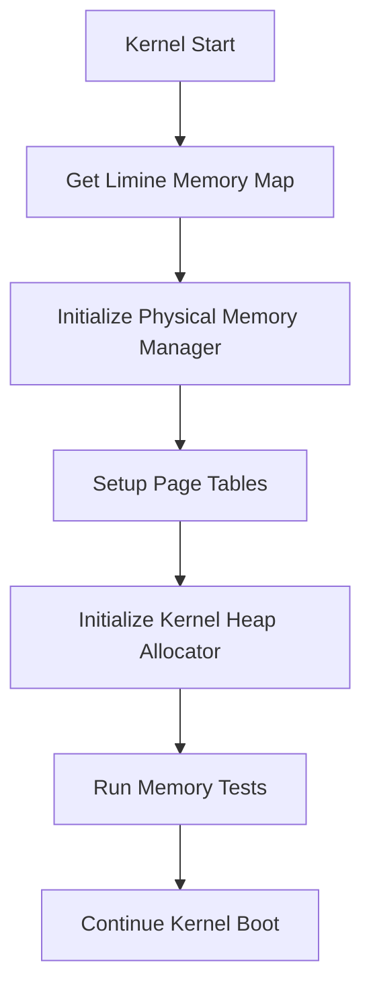

# Memory Management System Design

## Overview

ระบบ Memory Management ของ MelloOS จะประกอบด้วย 3 ส่วนหลัก:

1. **Physical Memory Allocator** - จัดการ physical memory frames (4KB pages)
2. **Paging System** - จัดการ virtual memory mapping ด้วย 4-level page tables
3. **Kernel Heap Allocator** - จัดสรรหน่วยความจำแบบ dynamic สำหรับ kernel

ระบบจะใช้ข้อมูล memory map จาก Limine bootloader เพื่อตรวจจับหน่วยความจำที่มีอยู่ และจัดการผ่าน higher-half kernel addressing (0xFFFF_8000_0000_0000+)

## Architecture

### Memory Layout

```
Physical Memory:
0x0000_0000_0000_0000 - 0x0000_FFFF_FFFF_FFFF  (Physical addresses)

Virtual Memory (Kernel Space):
0xFFFF_8000_0000_0000 - 0xFFFF_FFFF_FFFF_FFFF  (Higher half kernel)
  ├─ 0xFFFF_8000_0000_0000  Direct physical mapping
  ├─ 0xFFFF_A000_0000_0000  Kernel heap start
  └─ 0xFFFF_FFFF_FFFF_FFFF  End of address space
```

### Module Structure

```
kernel/src/
├── mm/
│   ├── mod.rs           # Memory management initialization & coordination
│   ├── pmm.rs           # Physical Memory Manager (frame allocator)
│   ├── paging.rs        # Page table management & virtual memory
│   └── allocator.rs     # Kernel heap allocator (buddy system)
└── main.rs              # Calls mm::init_memory()
```

### Initialization Flow



## Components and Interfaces

### 1. Physical Memory Manager (PMM)

**File:** `kernel/src/mm/pmm.rs`

**Purpose:** จัดการ physical memory frames (4KB blocks)

**Data Structures:**

```rust
/// Physical frame (4KB page)
const FRAME_SIZE: usize = 4096;

/// Bitmap allocator for tracking free frames
pub struct PhysicalMemoryManager {
    /// Bitmap where each bit represents one frame
    /// 0 = free, 1 = used
    bitmap: &'static mut [u8],
    /// Total number of frames
    total_frames: usize,
    /// Number of free frames
    free_frames: usize,
    /// Start of usable memory
    memory_start: usize,
    /// End of usable memory
    memory_end: usize,
    /// Last allocated frame index (for faster sequential allocation)
    last_alloc: usize,
}
```

**Key Functions:**

```rust
impl PhysicalMemoryManager {
    /// Initialize PMM from Limine memory map
    /// Filters for Usable memory only, marks kernel/page tables as used
    pub fn init(memory_map: &[MemoryMapEntry], kernel_start: usize, kernel_end: usize) -> Self;
    
    /// Allocate a physical frame (zeroed for security)
    /// Returns physical address or None if out of memory
    pub fn alloc_frame(&mut self) -> Option<usize>;
    
    /// Allocate contiguous frames (for DMA)
    pub fn alloc_contiguous(&mut self, count: usize, align: usize) -> Option<usize>;
    
    /// Free a physical frame
    pub fn free_frame(&mut self, addr: usize);
    
    /// Get total memory in MB
    pub fn total_memory_mb(&self) -> usize;
    
    /// Get free memory in MB
    pub fn free_memory_mb(&self) -> usize;
}
```

**Algorithm:** Bitmap allocator
- แต่ละ bit แทน 1 frame (4KB)
- Scan bitmap เพื่อหา free frame (start from last_alloc for speed)
- Zero frame on allocation (security)
- Filter memory types: accept only Usable, skip ACPI/Reserved/Framebuffer/Kernel
- Mark kernel image and initial page tables as used

### 2. Paging System

**File:** `kernel/src/mm/paging.rs`

**Purpose:** จัดการ virtual memory mapping ด้วย 4-level page tables

**Implementation Choice:**
- **Option A (Recommended):** ใช้ `x86_64` crate (`OffsetPageTable`, `Mapper`, `Page`, `PhysFrame`, `PageTableFlags`) - เร็ว, ลดบั๊ก
- **Option B (Learning):** Implement เองเพื่อเรียนรู้ลงลึก - ต้องระวัง PTE bits, CR3, TLB

**Data Structures (if implementing manually):**

```rust
/// Page table entry flags
#[repr(transparent)]
pub struct PageTableFlags(u64);

impl PageTableFlags {
    pub const PRESENT: u64 = 1 << 0;
    pub const WRITABLE: u64 = 1 << 1;
    pub const USER: u64 = 1 << 2;
    pub const WRITE_THROUGH: u64 = 1 << 3;
    pub const NO_CACHE: u64 = 1 << 4;
    pub const ACCESSED: u64 = 1 << 5;
    pub const DIRTY: u64 = 1 << 6;
    pub const HUGE: u64 = 1 << 7;
    pub const GLOBAL: u64 = 1 << 8;
    pub const NO_EXECUTE: u64 = 1 << 63; // Requires EFER.NXE
}

/// Page table entry
#[repr(transparent)]
pub struct PageTableEntry(u64);

impl PageTableEntry {
    /// Get physical address from entry (mask bits 12-51)
    pub fn addr(&self) -> usize;
    
    /// Set physical address and flags
    pub fn set(&mut self, addr: usize, flags: u64);
    
    /// Check if entry is present
    pub fn is_present(&self) -> bool;
    
    /// Clear entry
    pub fn clear(&mut self);
}

/// Page table (512 entries)
#[repr(align(4096))]
pub struct PageTable {
    entries: [PageTableEntry; 512],
}

/// Page mapper for managing virtual memory
pub struct PageMapper {
    pml4: &'static mut PageTable,
}
```

**CPU Setup Required:**
```rust
/// Enable NX bit support
fn enable_nx_bit() {
    // Set EFER.NXE (bit 11)
    unsafe {
        let mut efer = rdmsr(0xC0000080);
        efer |= 1 << 11;
        wrmsr(0xC0000080, efer);
    }
}

/// Enable write protection for kernel
fn enable_write_protect() {
    // Set CR0.WP (bit 16) - kernel respects page protections
    unsafe {
        let mut cr0: u64;
        asm!("mov {}, cr0", out(reg) cr0);
        cr0 |= 1 << 16;
        asm!("mov cr0, {}", in(reg) cr0);
    }
}
```

**Key Functions:**

```rust
impl PageMapper {
    /// Create new page mapper with current PML4
    pub fn new() -> Self;
    
    /// Map virtual address to physical address with proper flags
    pub fn map_page(&mut self, virt_addr: usize, phys_addr: usize, flags: u64);
    
    /// Unmap virtual address and invalidate TLB
    pub fn unmap_page(&mut self, virt_addr: usize);
    
    /// Translate virtual address to physical address
    pub fn translate(&self, virt_addr: usize) -> Option<usize>;
    
    /// Identity map a range (virt = phys) for low memory/DMA
    pub fn identity_map_range(&mut self, start: usize, end: usize, flags: u64);
    
    /// Map kernel sections with appropriate flags
    pub fn map_kernel_sections(&mut self);
}

/// Invalidate TLB entry for single page
fn invlpg(addr: usize) {
    unsafe {
        asm!("invlpg [{}]", in(reg) addr, options(nostack, preserves_flags));
    }
}
```

**Kernel Section Mapping:**
```rust
// .text section: Read + Execute (no write)
map_range(text_start, text_end, PRESENT | GLOBAL);

// .rodata section: Read only
map_range(rodata_start, rodata_end, PRESENT | NO_EXECUTE | GLOBAL);

// .data/.bss section: Read + Write (no execute)
map_range(data_start, data_end, PRESENT | WRITABLE | NO_EXECUTE | GLOBAL);

// Heap: Read + Write (no execute)
map_range(heap_start, heap_end, PRESENT | WRITABLE | NO_EXECUTE);

// Guard pages: Unmapped (for stack/heap overflow protection)
unmap_page(guard_page_addr);
```

**4-Level Paging Structure:**

```
Virtual Address (48-bit):
[47:39] PML4 index (9 bits)
[38:30] PDPT index (9 bits)
[29:21] PD index (9 bits)
[20:12] PT index (9 bits)
[11:0]  Offset (12 bits)
```

**Algorithm:**
1. แยก virtual address เป็น indices
2. Traverse PML4 → PDPT → PD → PT
3. สร้าง intermediate tables ถ้ายังไม่มี
4. ตั้งค่า final PT entry

### 3. Kernel Heap Allocator

**File:** `kernel/src/mm/allocator.rs`

**Purpose:** จัดสรรหน่วยความจำแบบ dynamic สำหรับ kernel (kmalloc/kfree)

**Concurrency:** ใช้ `spin::Mutex` เพื่อ thread-safety

**Data Structures:**

```rust
/// Buddy allocator block sizes (power of 2)
const MIN_BLOCK_SIZE: usize = 64;      // 64 bytes
const MAX_BLOCK_SIZE: usize = 1048576; // 1 MB
const NUM_ORDERS: usize = 15;          // 64B to 1MB

/// Free list node
struct FreeBlock {
    size: usize,
    next: Option<*mut FreeBlock>,
}

/// Buddy allocator (wrapped in Mutex for thread-safety)
pub struct BuddyAllocator {
    /// Free lists for each order (size = 2^order * MIN_BLOCK_SIZE)
    free_lists: [Option<*mut FreeBlock>; NUM_ORDERS],
    /// Start of heap
    heap_start: usize,
    /// End of heap
    heap_end: usize,
    /// Total allocated bytes
    allocated: usize,
}

/// Global allocator instance
static ALLOCATOR: Mutex<Option<BuddyAllocator>> = Mutex::new(None);
```

**Key Functions:**

```rust
impl BuddyAllocator {
    /// Initialize allocator with heap range
    pub fn init(start: usize, size: usize) -> Self;
    
    /// Allocate memory (zeroed for security)
    pub fn alloc(&mut self, size: usize) -> *mut u8;
    
    /// Free memory
    pub fn free(&mut self, ptr: *mut u8);
    
    /// Get allocated memory in bytes
    pub fn allocated_bytes(&self) -> usize;
}

/// Public API (thread-safe)
pub fn kmalloc(size: usize) -> *mut u8 {
    let mut allocator = ALLOCATOR.lock();
    let ptr = allocator.as_mut().unwrap().alloc(size);
    // Zero memory for security
    if !ptr.is_null() {
        unsafe { core::ptr::write_bytes(ptr, 0, size); }
    }
    ptr
}

pub fn kfree(ptr: *mut u8) {
    let mut allocator = ALLOCATOR.lock();
    allocator.as_mut().unwrap().free(ptr);
}
```

**Buddy Algorithm:**

1. **Allocation:**
   - Round up size to nearest power of 2
   - Find free block in appropriate order
   - If no block, split larger block recursively
   - Return pointer to allocated block

2. **Deallocation:**
   - Find buddy block (XOR address with size)
   - If buddy is free, merge and try next order
   - Otherwise, add to free list

```
Example: Allocate 100 bytes
1. Round up to 128 bytes (order 1)
2. Check free_lists[1] - empty
3. Check free_lists[2] (256 bytes) - has block
4. Split 256 → two 128-byte blocks
5. Return first block, add second to free_lists[1]
```

### 4. Memory Management Coordinator

**File:** `kernel/src/mm/mod.rs`

**Purpose:** รวมและประสานงานระหว่าง PMM, Paging, และ Allocator

**Key Functions:**

```rust
/// Initialize entire memory management system
pub fn init_memory() {
    // 1. Get HHDM offset from Limine (DO NOT hardcode!)
    // 2. Get memory map from Limine
    // 3. Enable NX bit and write protection
    // 4. Initialize PMM (filter Usable memory, mark kernel as used)
    // 5. Setup paging (map kernel sections with proper flags)
    // 6. Add guard pages around kernel stack/heap
    // 7. Initialize kernel heap allocator
    // 8. Run tests
    // 9. Log summary
}
```

**Limine Requests:**

```rust
use limine::request::{MemoryMapRequest, HhdmRequest, KernelAddressRequest};

#[used]
#[link_section = ".requests"]
static MEMORY_MAP_REQUEST: MemoryMapRequest = MemoryMapRequest::new();

#[used]
#[link_section = ".requests"]
static HHDM_REQUEST: HhdmRequest = HhdmRequest::new();

#[used]
#[link_section = ".requests"]
static KERNEL_ADDRESS_REQUEST: KernelAddressRequest = KernelAddressRequest::new();
```

## Data Models

### Memory Map Entry (from Limine)

```rust
pub struct MemoryMapEntry {
    pub base: u64,      // Start address
    pub length: u64,    // Size in bytes
    pub entry_type: u32, // Type (usable, reserved, etc.)
}
```

### Address Types

```rust
/// Physical address (0x0000_0000_0000_0000 - 0x0000_FFFF_FFFF_FFFF)
pub type PhysAddr = usize;

/// Virtual address (0xFFFF_8000_0000_0000 - 0xFFFF_FFFF_FFFF_FFFF)
pub type VirtAddr = usize;

/// HHDM offset from Limine (DO NOT hardcode!)
static HHDM_OFFSET: AtomicUsize = AtomicUsize::new(0);

/// Initialize HHDM offset from Limine
pub fn init_hhdm(offset: usize) {
    HHDM_OFFSET.store(offset, Ordering::Relaxed);
}

/// Convert physical to virtual (direct mapping)
pub fn phys_to_virt(phys: PhysAddr) -> VirtAddr {
    phys + HHDM_OFFSET.load(Ordering::Relaxed)
}

/// Convert virtual to physical (direct mapping)
pub fn virt_to_phys(virt: VirtAddr) -> PhysAddr {
    virt - HHDM_OFFSET.load(Ordering::Relaxed)
}
```

## Error Handling

### Error Types

```rust
pub enum MemoryError {
    /// Out of physical memory
    OutOfMemory,
    /// Invalid address
    InvalidAddress,
    /// Page already mapped
    AlreadyMapped,
    /// Page not mapped
    NotMapped,
    /// Alignment error
    NotAligned,
}
```

### Error Handling Strategy

1. **Critical Errors:** Panic ทันที (out of memory ตอน init)
2. **Recoverable Errors:** Return Option/Result
3. **Logging:** ทุก error ต้องมี log message พร้อม context

### Example Error Handling

```rust
pub fn map_page(&mut self, virt: usize, phys: usize) -> Result<(), MemoryError> {
    // Check alignment
    if virt % 4096 != 0 || phys % 4096 != 0 {
        kprintln!("[MM] ERROR: Address not aligned: virt=0x{:x}, phys=0x{:x}", virt, phys);
        return Err(MemoryError::NotAligned);
    }
    
    // Check if already mapped
    if self.translate(virt).is_some() {
        kprintln!("[MM] ERROR: Page already mapped: 0x{:x}", virt);
        return Err(MemoryError::AlreadyMapped);
    }
    
    // Allocate frame if needed
    let frame = PMM.lock().alloc_frame()
        .ok_or_else(|| {
            kprintln!("[MM] ERROR: Out of physical memory");
            MemoryError::OutOfMemory
        })?;
    
    // Map page...
    Ok(())
}
```

## Testing Strategy

### Unit Testing Approach

เนื่องจาก kernel code ไม่สามารถใช้ standard Rust testing framework ได้ เราจะใช้ manual testing ใน kernel

### Test Cases

**1. Physical Memory Manager Tests**

```rust
fn test_pmm() {
    kprintln!("[MM] Testing PMM...");
    
    // Test 1: Allocate frame
    let frame1 = pmm.alloc_frame().expect("Failed to allocate frame");
    kprintln!("[MM] ✓ Allocated frame at 0x{:x}", frame1);
    
    // Test 2: Allocate multiple frames
    let frame2 = pmm.alloc_frame().expect("Failed to allocate frame");
    assert!(frame1 != frame2, "Frames should be different");
    kprintln!("[MM] ✓ Allocated different frame at 0x{:x}", frame2);
    
    // Test 3: Free and reallocate
    pmm.free_frame(frame1);
    let frame3 = pmm.alloc_frame().expect("Failed to allocate frame");
    assert!(frame3 == frame1, "Should reuse freed frame");
    kprintln!("[MM] ✓ Reused freed frame");
}
```

**2. Paging Tests**

```rust
fn test_paging() {
    kprintln!("[MM] Testing paging...");
    
    // Test 1: Map and translate
    let virt = 0xFFFF_A000_0000_0000;
    let phys = 0x1000;
    mapper.map_page(virt, phys, FLAGS_RW);
    let translated = mapper.translate(virt).expect("Translation failed");
    assert!(translated == phys, "Translation mismatch");
    kprintln!("[MM] ✓ Page mapping works");
    
    // Test 2: Unmap
    mapper.unmap_page(virt);
    assert!(mapper.translate(virt).is_none(), "Page should be unmapped");
    kprintln!("[MM] ✓ Page unmapping works");
}
```

**3. Allocator Tests**

```rust
fn test_allocator() {
    kprintln!("[MM] Testing allocator...");
    
    // Test 1: Basic allocation
    let ptr = kmalloc(1024);
    assert!(!ptr.is_null(), "Allocation failed");
    kprintln!("[MM] ✓ Allocated 1KB at 0x{:p}", ptr);
    
    // Test 2: Write and read
    unsafe {
        *ptr = 0x42;
        assert!(*ptr == 0x42, "Memory write/read failed");
    }
    kprintln!("[MM] ✓ Memory read/write works");
    
    // Test 3: Free
    kfree(ptr);
    kprintln!("[MM] ✓ Freed memory");
    
    // Test 4: Multiple allocations
    let ptrs: [*mut u8; 10] = [core::ptr::null_mut(); 10];
    for i in 0..10 {
        ptrs[i] = kmalloc(64);
        assert!(!ptrs[i].is_null(), "Allocation failed");
    }
    kprintln!("[MM] ✓ Multiple allocations work");
    
    // Free all
    for ptr in ptrs.iter() {
        kfree(*ptr);
    }
    kprintln!("[MM] ✓ Multiple frees work");
}
```

### Integration Testing

```rust
pub fn run_memory_tests() {
    kprintln!("[MM] ========================================");
    kprintln!("[MM] Running Memory Management Tests");
    kprintln!("[MM] ========================================");
    
    test_pmm();
    test_paging();
    test_allocator();
    
    kprintln!("[MM] ========================================");
    kprintln!("[MM] All tests passed! ✨");
    kprintln!("[MM] ========================================");
}
```

### Logging Format

ทุก log message จะใช้รูปแบบ:

```
[MM] <level>: <message>
```

Levels:
- `INFO` - ข้อมูลทั่วไป
- `DEBUG` - ข้อมูล debug (optional)
- `ERROR` - ข้อผิดพลาด
- `✓` - Test passed
- `✗` - Test failed

Example output:

```
[MM] Initializing memory management...
[MM] Total memory: 8192 MB
[MM] Usable memory: 7680 MB
[MM] Physical memory manager initialized
[MM] Page tables initialized
[MM] Kernel heap: 0xFFFF_A000_0000_0000 - 0xFFFF_A000_0100_0000 (16 MB)
[MM] ========================================
[MM] Running Memory Management Tests
[MM] ========================================
[MM] Testing PMM...
[MM] ✓ Allocated frame at 0x100000
[MM] ✓ Allocated different frame at 0x101000
[MM] ✓ Reused freed frame
[MM] Testing allocator...
[MM] Allocated 1024 bytes at 0xFFFF_A000_0000_1000
[MM] ✓ Memory read/write works
[MM] Freed 1024 bytes from 0xFFFF_A000_0000_1000
[MM] ========================================
[MM] All tests passed! ✨
[MM] ========================================
```

## Performance Considerations

### Physical Memory Manager
- **Bitmap scan:** O(n) worst case, but fast for typical workloads
- **Optimization:** Cache last allocated position for faster sequential allocations

### Paging
- **TLB invalidation:** ใช้ `invlpg` instruction สำหรับ single page
- **Batch operations:** Group multiple mappings แล้วค่อย flush TLB

### Buddy Allocator
- **Time complexity:** O(log n) for allocation and deallocation
- **Space overhead:** ~12.5% for metadata
- **Fragmentation:** Better than simple free list, worse than slab allocator

## Security Considerations

1. **Address Validation:** ตรวจสอบ address alignment และ bounds ทุกครั้ง
2. **Kernel/User Separation:** ใช้ page table flags เพื่อป้องกัน user access kernel memory
3. **No Execute (NX):** ตั้งค่า NX bit สำหรับ data pages
4. **Guard Pages:** ใส่ unmapped pages รอบๆ kernel stack

## Future Enhancements

1. **Slab Allocator:** สำหรับ frequently-allocated objects
2. **Copy-on-Write:** สำหรับ process forking
3. **Demand Paging:** Load pages เมื่อต้องการใช้งาน
4. **Memory Pressure Handling:** Swap/eviction policies
5. **NUMA Support:** สำหรับ multi-processor systems
6. **Huge Pages:** 2MB/1GB pages สำหรับ performance

## Dependencies

### External Crates
- `limine` - สำหรับ bootloader protocol
- `spin` - สำหรับ `Mutex` (thread-safe locking)
- `x86_64` (optional) - สำหรับ paging helpers (recommended)

### Kernel Modules
- `framebuffer` - สำหรับแสดง log messages (ถ้าต้องการ)
- `panic` - สำหรับ error handling

### Hardware Requirements
- x86_64 CPU with paging support
- CPU with NX bit support (EFER.NXE)
- Minimum 8MB RAM (recommended 64MB+)

## References

- [Intel 64 and IA-32 Architectures Software Developer's Manual](https://www.intel.com/content/www/us/en/developer/articles/technical/intel-sdm.html)
- [OSDev Wiki - Paging](https://wiki.osdev.org/Paging)
- [OSDev Wiki - Page Frame Allocation](https://wiki.osdev.org/Page_Frame_Allocation)
- [The Buddy System](https://en.wikipedia.org/wiki/Buddy_memory_allocation)
