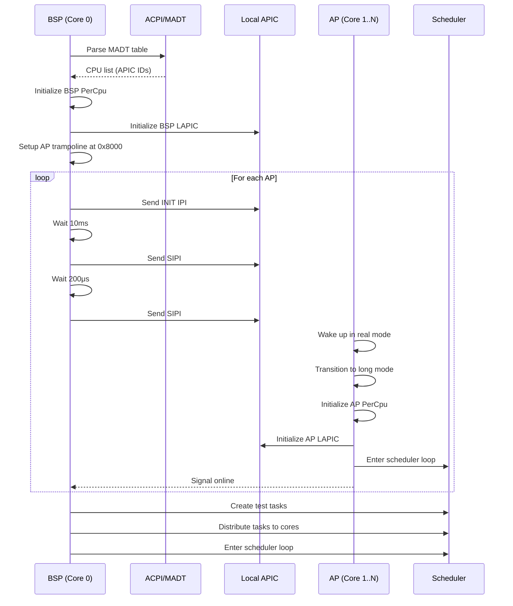

# Design Document: SMP Multi-core Support

## Overview

This design document describes the implementation of Symmetric Multi-Processing (SMP) support for MelloOS kernel. The design enables the kernel to detect, initialize, and utilize multiple CPU cores simultaneously, with proper synchronization, per-core scheduling, and inter-processor communication.

The SMP implementation follows a layered architecture:
1. **ACPI/MADT Layer**: CPU core discovery and APIC topology
2. **APIC Layer**: Local APIC initialization, timer management, and IPI delivery
3. **SMP Bootstrap Layer**: AP bringup sequence and trampoline code
4. **Per-CPU Layer**: Core-local data structures and accessors
5. **Synchronization Layer**: Spinlocks and atomic operations
6. **Scheduler Integration**: Per-core runqueues and load balancing

## Architecture

### High-Level Component Diagram

```
┌─────────────────────────────────────────────────────────────┐
│                        MelloOS Kernel                        │
├─────────────────────────────────────────────────────────────┤
│                                                               │
│  ┌──────────────┐  ┌──────────────┐  ┌──────────────┐      │
│  │   Core 0     │  │   Core 1     │  │   Core N     │      │
│  │   (BSP)      │  │    (AP)      │  │    (AP)      │      │
│  ├──────────────┤  ├──────────────┤  ├──────────────┤      │
│  │ PerCpu Data  │  │ PerCpu Data  │  │ PerCpu Data  │      │
│  │ - Runqueue   │  │ - Runqueue   │  │ - Runqueue   │      │
│  │ - Current    │  │ - Current    │  │ - Current    │      │
│  │ - LAPIC      │  │ - LAPIC      │  │ - LAPIC      │      │
│  └──────┬───────┘  └──────┬───────┘  └──────┬───────┘      │
│         │                 │                 │               │
│         └─────────────────┼─────────────────┘               │
│                           │                                 │
│  ┌────────────────────────┴──────────────────────────┐     │
│  │         Scheduler (Per-Core + Load Balancer)      │     │
│  └────────────────────────┬──────────────────────────┘     │
│                           │                                 │
│  ┌────────────────────────┴──────────────────────────┐     │
│  │      Synchronization (Spinlocks, Atomics)         │     │
│  └────────────────────────┬──────────────────────────┘     │
│                           │                                 │
│  ┌────────────────────────┴──────────────────────────┐     │
│  │         APIC (LAPIC, IPI, Timer)                  │     │
│  └────────────────────────┬──────────────────────────┘     │
│                           │                                 │
│  ┌────────────────────────┴──────────────────────────┐     │
│  │         ACPI/MADT (CPU Discovery)                 │     │
│  └───────────────────────────────────────────────────┘     │
│                                                               │
└─────────────────────────────────────────────────────────────┘
```

### Boot Sequence Flow



## Components and Interfaces

### 1. ACPI/MADT Parser (`arch/x86_64/acpi/mod.rs`)

**Purpose**: Parse ACPI MADT table to discover CPU cores and APIC configuration.

**Key Structures**:
```rust
pub struct MadtInfo {
    pub lapic_address: u64,
    pub cpus: Vec<CpuInfo>,
    pub ioapics: Vec<IoApicInfo>,
}

pub struct CpuInfo {
    pub apic_id: u8,
    pub processor_id: u8,
    pub enabled: bool,
}

pub struct IoApicInfo {
    pub id: u8,
    pub address: u32,
    pub gsi_base: u32,
}
```

**Interface**:
```rust
pub fn parse_madt(rsdp_addr: u64) -> Result<MadtInfo, AcpiError>;
```

**Implementation Notes**:
- Locate RSDP (Root System Description Pointer) from bootloader info
- Follow RSDT/XSDT to find MADT
- Parse MADT entries: Type 0 (Local APIC), Type 1 (I/O APIC)
- Validate checksums and table signatures
- Filter enabled CPUs only

### 2. Local APIC Management (`arch/x86_64/apic/mod.rs`)

**Purpose**: Initialize and manage Local APIC for each CPU core.

**Key Constants**:
```rust
const LAPIC_ID: u32 = 0x20;
const LAPIC_EOI: u32 = 0xB0;
const LAPIC_SPURIOUS: u32 = 0xF0;
const LAPIC_ICR_LOW: u32 = 0x300;
const LAPIC_ICR_HIGH: u32 = 0x310;
const LAPIC_TIMER_LVT: u32 = 0x320;
const LAPIC_TIMER_INIT_COUNT: u32 = 0x380;
const LAPIC_TIMER_CURRENT_COUNT: u32 = 0x390;
const LAPIC_TIMER_DIVIDE: u32 = 0x3E0;

const SPURIOUS_VECTOR: u8 = 0xFF;
const TIMER_VECTOR: u8 = 0x20;
const RESCHEDULE_IPI_VECTOR: u8 = 0x30;
```

**Interface**:
```rust
pub struct LocalApic {
    base_addr: *mut u32,
}

impl LocalApic {
    pub unsafe fn new(base_addr: u64) -> Self;
    pub fn init(&mut self);
    pub fn id(&self) -> u8;
    pub fn eoi(&mut self);
    pub fn send_ipi(&mut self, apic_id: u8, vector: u8);
    pub fn send_init_ipi(&mut self, apic_id: u8);
    pub fn send_sipi(&mut self, apic_id: u8, start_page: u8);
    pub fn init_timer(&mut self, frequency_hz: u64);
    pub fn calibrate_timer(&mut self) -> u64;
}
```

**Implementation Notes**:
- Use memory-mapped I/O at address from MADT (typically 0xFEE00000)
- Enable LAPIC by setting bit 8 in spurious interrupt vector register
- Set spurious vector to 0xFF
- For timer calibration: use PIT channel 2 or TSC as reference
- IPI delivery: write destination APIC ID to ICR high, then command to ICR low
- Wait for delivery status bit to clear after sending IPI

### 3. SMP Bootstrap (`arch/x86_64/smp/mod.rs`)

**Purpose**: Orchestrate the bringup of Application Processors.

**Interface**:
```rust
pub fn init_smp(madt_info: &MadtInfo) -> Result<usize, SmpError>;
pub fn get_cpu_count() -> usize;
pub fn get_current_cpu_id() -> usize;
```

**AP Trampoline** (`arch/x86_64/smp/boot_ap.S`):

The trampoline code must:
1. Start in 16-bit real mode at 0x8000
2. Enable A20 line
3. Load temporary GDT with 32-bit code/data segments
4. Enter protected mode (CR0.PE = 1)
5. Load 64-bit GDT
6. Enable PAE (CR4.PAE = 1)
7. Load CR3 with kernel page table
8. Enable long mode (EFER.LME = 1)
9. Enable paging (CR0.PG = 1)
10. Jump to 64-bit entry point `ap_entry64`

**Trampoline Memory Layout**:
```
0x8000: trampoline_start (16-bit code)
0x8100: gdt32 (temporary 32-bit GDT)
0x8200: gdt64 (64-bit GDT)
0x8300: ap_stack_ptr (pointer to AP stack)
0x8308: ap_entry_ptr (pointer to ap_entry64)
0x8310: ap_cr3 (kernel page table)
0x8318: ap_cpu_id (assigned CPU ID)
```

**Implementation Notes**:
- Copy trampoline code to 0x8000 during BSP initialization
- Identity map entire range 0x0000-0x9FFF (40KB) in kernel page tables with flags: present + executable + writable
- Allocate per-AP stacks (16KB each) using boot allocator (kmalloc_aligned with 16-byte alignment)
- For each AP, write allocated stack pointer to trampoline structure at 0x8300 before sending SIPI
- Use atomic counter to track AP online status
- BSP waits up to 100ms for each AP to signal online

### 4. Per-CPU Data (`arch/x86_64/smp/percpu.rs`)

**Purpose**: Provide core-local data structures accessible without locks.

**Key Structure**:
```rust
#[repr(C, align(64))]  // Cache line aligned
pub struct PerCpu {
    pub id: usize,
    pub apic_id: u8,
    pub node_id: u8,  // NUMA node ID (for future NUMA support)
    pub runqueue: SpinLock<VecDeque<TaskId>>,
    pub current_task: Option<TaskId>,
    pub idle_task: TaskId,
    pub lapic_timer_hz: u64,
    pub ticks: AtomicU64,
    pub in_interrupt: bool,
}

static PERCPU_ARRAY: [PerCpu; MAX_CPUS] = ...;
```

**Interface**:
```rust
pub fn init_percpu(cpu_id: usize, apic_id: u8);
pub fn percpu_current() -> &'static mut PerCpu;
pub fn percpu_for(cpu_id: usize) -> &'static PerCpu;
```

**Implementation Notes**:
- Use MSR 0xC0000101 (GS.BASE) to store pointer to PerCpu
- BSP sets GS.BASE during early init
- Each AP sets its own GS.BASE in ap_entry64
- Access via `rdgsbase` or `mov rax, gs:[offset]`
- Align to cache line (64 bytes) to avoid false sharing

### 5. Synchronization Primitives (`sync/spin.rs`)

**Purpose**: Provide thread-safe synchronization for shared data.

**SpinLock Implementation**:
```rust
pub struct SpinLock<T> {
    locked: AtomicBool,
    data: UnsafeCell<T>,
}

pub struct SpinLockGuard<'a, T> {
    lock: &'a SpinLock<T>,
}

impl<T> SpinLock<T> {
    pub const fn new(data: T) -> Self;
    pub fn lock(&self) -> SpinLockGuard<T>;
    pub fn try_lock(&self) -> Option<SpinLockGuard<T>>;
}

impl<T> Drop for SpinLockGuard<'_, T> {
    fn drop(&mut self);
}
```

**IRQ-Safe Variant**:
```rust
pub struct IrqSpinLock<T> {
    inner: SpinLock<T>,
}

pub struct IrqSpinLockGuard<'a, T> {
    guard: SpinLockGuard<'a, T>,
    flags: u64,
}

impl<T> IrqSpinLock<T> {
    pub fn lock(&self) -> IrqSpinLockGuard<T>;
}
```

**Implementation Notes**:
- Use `compare_exchange` with Acquire/Release ordering
- Implement exponential backoff: start with 1 pause, double up to 256
- Use `core::hint::spin_loop()` for pause instruction to allow compiler optimization
- IRQ-safe version: save RFLAGS, disable interrupts (cli), restore on unlock
- Prevent deadlock: document lock ordering (e.g., runqueue before task)

### 6. Scheduler Integration (`sched/mod.rs`)

**Purpose**: Extend existing scheduler to support per-core runqueues and load balancing.

**Modified Scheduler Structure**:
```rust
// Per-core runqueue is now in PerCpu structure
// Global scheduler state:
pub struct Scheduler {
    pub tasks: SpinLock<BTreeMap<TaskId, Task>>,
    pub next_tid: AtomicUsize,
}

pub static SCHEDULER: Scheduler = ...;
```

**Interface Extensions**:
```rust
pub fn schedule_on_core(cpu_id: usize);
pub fn enqueue_task(task_id: TaskId, target_cpu: Option<usize>);
pub fn dequeue_task(cpu_id: usize) -> Option<TaskId>;
pub fn balance_load();
pub fn migrate_task(task_id: TaskId, from_cpu: usize, to_cpu: usize);
```

**Load Balancing Strategy**:
1. **Initial Placement**: Assign new tasks to CPU with smallest runqueue
2. **Periodic Rebalancing**: Every 100ms, check if any CPU has >2 more tasks than others
3. **Migration**: Move lowest-priority task from busy CPU to idle CPU
4. **IPI Notification**: Send RESCHEDULE_IPI to target CPU after migration

**Implementation Notes**:
- Each core's timer interrupt calls `schedule_on_core(current_cpu_id())`
- Runqueue protected by per-CPU spinlock
- Task migration requires locking both source and destination runqueues (ordered by CPU ID)
- Idle task per core: infinite loop with `hlt` instruction

### 7. Timer Management (`sched/timer.rs`)

**Purpose**: Manage per-core APIC timers for preemptive scheduling.

**Configuration** (`kernel/config.rs`):
```rust
pub const SCHED_HZ: u64 = 100;  // Scheduler tick frequency (100 Hz = 10ms)
```

**Interface**:
```rust
pub fn init_timer_on_core(frequency_hz: u64);
pub fn timer_interrupt_handler();
```

**Timer Calibration Process**:
1. Program PIT channel 2 for 10ms one-shot
2. Set LAPIC timer to maximum count (0xFFFFFFFF)
3. Wait for PIT to fire
4. Read LAPIC current count
5. Calculate: `ticks_per_10ms = 0xFFFFFFFF - current_count`
6. Derive frequency: `lapic_hz = ticks_per_10ms * 100`

**Implementation Notes**:
- Use LAPIC timer in periodic mode
- Set divide value to 16 (register 0x3E0 = 0x3)
- Calculate initial count: `init_count = lapic_hz / (16 * frequency_hz)`
- Timer vector (0x20) triggers scheduler tick
- Each core independently manages its timer

### 8. Inter-Processor Interrupts (`arch/x86_64/apic/ipi.rs`)

**Purpose**: Enable cores to send interrupts to each other.

**Interface**:
```rust
pub fn send_ipi(target_apic_id: u8, vector: u8);
pub fn broadcast_ipi(vector: u8, exclude_self: bool);
pub fn send_reschedule_ipi(cpu_id: usize);
```

**Broadcast Implementation Notes**:
- Use CPU_STATES bitmask to determine active CPUs
- If exclude_self is true, filter out current CPU's APIC ID from target list
- Send individual IPIs to each target (no hardware broadcast mode for safety)

**IPI Vectors**:
- `0x30`: RESCHEDULE_IPI - trigger scheduler on target core
- `0x31`: TLB_FLUSH_IPI - flush TLB on target core (future)
- `0x32`: HALT_IPI - halt target core (future)

**RESCHEDULE_IPI Handler**:
```rust
pub extern "x86-interrupt" fn reschedule_ipi_handler(_frame: InterruptStackFrame) {
    let cpu = percpu_current();
    cpu.lapic.eoi();
    schedule_on_core(cpu.id);
}
```

**Implementation Notes**:
- Write destination APIC ID to ICR[63:56]
- Write vector and delivery mode to ICR[7:0] and ICR[10:8]
- Delivery mode: 000b (Fixed)
- Wait for delivery status (ICR[12]) to clear
- Log IPI sends for debugging

## Data Models

### CPU Information Model

```rust
pub struct CpuInfo {
    pub apic_id: u8,
    pub processor_id: u8,
    pub enabled: bool,
}

pub struct CpuState {
    pub info: CpuInfo,
    pub percpu: &'static mut PerCpu,
    pub online: AtomicBool,
}

static CPU_STATES: [CpuState; MAX_CPUS] = ...;
```

### Task Affinity Model

```rust
pub enum CpuAffinity {
    Any,                    // Can run on any CPU
    Pinned(usize),          // Must run on specific CPU
    Mask(u64),              // Can run on CPUs in bitmask
}

pub struct Task {
    // ... existing fields ...
    pub affinity: CpuAffinity,
    pub last_cpu: usize,
    pub cpu_time: u64,
}
```

### Runqueue Model

```rust
// In PerCpu structure:
pub runqueue: SpinLock<VecDeque<TaskId>>

// Priority-based scheduling within runqueue:
// - Higher priority tasks at front
// - Same priority: round-robin (FIFO)
```

## Error Handling

### Error Types

```rust
pub enum SmpError {
    AcpiParseError,
    NoApicFound,
    ApBootTimeout(u8),
    InvalidApicId(u8),
    TrampolineSetupFailed,
}

pub enum ApicError {
    InvalidBaseAddress,
    CalibrationFailed,
    IpiTimeout,
}
```

### Error Recovery Strategies

1. **AP Boot Failure**: Log error, continue with available CPUs
2. **APIC Calibration Failure**: Fall back to default frequency (100Hz)
3. **IPI Timeout**: Log warning, assume message lost, continue
4. **Deadlock Detection**: Implement spinlock timeout (debug builds only)

### Panic Handling in SMP

```rust
pub fn panic_all_cpus(message: &str) {
    // Disable interrupts on current CPU
    unsafe { asm!("cli") };
    
    // Send HALT IPI to all other CPUs
    broadcast_ipi(HALT_IPI_VECTOR, true);
    
    // Print panic message
    serial_println!("[PANIC] CPU {}: {}", percpu_current().id, message);
    
    // Halt forever
    loop {
        unsafe { asm!("hlt") };
    }
}
```

## Testing Strategy

### Unit Tests

1. **MADT Parser Tests**:
   - Parse valid MADT with multiple CPUs
   - Handle malformed MADT gracefully
   - Verify checksum validation

2. **SpinLock Tests**:
   - Single-threaded lock/unlock
   - Verify memory ordering
   - Test IRQ-safe variant

3. **PerCpu Accessor Tests**:
   - Verify GS.BASE setup
   - Test percpu_current() returns correct structure

### Integration Tests

1. **AP Bringup Test**:
   - Boot with 2 CPUs, verify both online
   - Boot with 4 CPUs, verify all online
   - Check each CPU has unique ID

2. **Per-Core Scheduling Test**:
   - Create 4 tasks, verify distribution across 2 CPUs
   - Verify each task logs with correct core ID
   - Check runqueue sizes are balanced

3. **IPI Test**:
   - Send RESCHEDULE_IPI from CPU 0 to CPU 1
   - Verify CPU 1 receives and handles IPI
   - Check IPI handler logs

4. **Timer Test**:
   - Verify each CPU receives timer interrupts
   - Check tick counts increment independently
   - Verify scheduler is called on each tick

### System Tests

1. **Stress Test**:
   - Create 16 tasks on 4 CPUs
   - Run for 60 seconds
   - Verify no panics, deadlocks, or hangs

2. **IPC Cross-Core Test**:
   - Task on CPU 0 sends message to task on CPU 1
   - Verify message delivery and response
   - Check IPC queue synchronization

3. **Syscall Concurrency Test**:
   - Multiple tasks on different CPUs make syscalls simultaneously
   - Verify no data corruption
   - Check syscall serialization works correctly

### QEMU Test Configuration

```bash
# Test with 2 CPUs
qemu-system-x86_64 -cdrom mellos.iso -smp 2 -enable-kvm -serial stdio

# Test with 4 CPUs
qemu-system-x86_64 -cdrom mellos.iso -smp 4 -enable-kvm -serial stdio

# Test without KVM (slower but more compatible)
qemu-system-x86_64 -cdrom mellos.iso -smp 4 -serial stdio
```

### Expected Log Output

```
[ACPI] RSDP found at 0x...
[ACPI] MADT found at 0x...
[SMP] CPUs detected: 4 (apic_ids=[0,1,2,3])
[APIC] BSP LAPIC initialized at 0xFEE00000
[SMP] BSP online (apic_id=0)
[SMP] Trampoline copied to 0x8000
[SMP] Sending INIT to AP#1 (apic_id=1)
[SMP] Sending SIPI to AP#1 (vector=0x08)
[SMP] AP#1 online
[APIC] core1 timer @100Hz
[SMP] Sending INIT to AP#2 (apic_id=2)
[SMP] Sending SIPI to AP#2 (vector=0x08)
[SMP] AP#2 online
[APIC] core2 timer @100Hz
[SMP] Sending INIT to AP#3 (apic_id=3)
[SMP] Sending SIPI to AP#3 (vector=0x08)
[SMP] AP#3 online
[APIC] core3 timer @100Hz
[SCHED] Created task A (priority=10)
[SCHED] Created task B (priority=5)
[SCHED] Created task C (priority=8)
[SCHED] Created task D (priority=3)
[SCHED][core0] run A
[SCHED][core1] run C
[SCHED][core2] run B
[SCHED][core3] run D
[SCHED] send RESCHED IPI → core1
[SCHED][core1] preempt C → run A
```

## Performance Considerations

### Cache Line Alignment

- Align PerCpu structures to 64-byte cache lines
- Prevents false sharing between cores
- Use `#[repr(C, align(64))]`

### Lock Contention Reduction

- Minimize critical sections
- Use per-core data structures where possible
- Implement lock-free algorithms for hot paths (e.g., task enqueue)

### IPI Overhead

- Batch IPI sends when possible
- Avoid unnecessary IPIs (check if target CPU is idle first)
- Use broadcast IPIs sparingly

### Memory Ordering

- Use Acquire/Release ordering for most synchronization
- Use SeqCst only when necessary (e.g., panic handling)
- Document memory ordering choices

## Security Considerations

### CPU Isolation

- Ensure per-CPU data is truly isolated
- Prevent one CPU from corrupting another's state
- Validate CPU IDs in all per-CPU accessors

### IPI Security

- Validate IPI vector numbers
- Prevent user space from triggering IPIs
- Rate-limit IPI sends to prevent DoS

### Synchronization Safety

- Prevent priority inversion with proper lock ordering
- Implement deadlock detection in debug builds
- Use IRQ-safe locks for interrupt-accessible data

### Syscall SMP Safety

All syscalls from Phase 4 must be made SMP-safe:

**Synchronization Strategy**:
- **Global Syscall Table**: Read-only, no locking needed
- **Task Operations**: Use per-task spinlocks (already in Task structure)
- **IPC Operations**: Port queues protected by per-port spinlocks
- **Memory Operations**: Page table modifications use per-process locks
- **Scheduler Operations**: Per-core runqueues with per-CPU spinlocks

**Lock Ordering Rules**:
1. Global locks before per-object locks
2. Task locks before port locks
3. Runqueue locks ordered by CPU ID (lower ID first)
4. Never hold multiple runqueue locks unless migrating tasks

**Syscall Handler Modifications**:
```rust
pub fn syscall_handler(syscall_num: u64, args: &[u64]) -> Result<u64, SyscallError> {
    // No global lock needed - syscalls operate on per-object data
    // Each syscall implementation uses appropriate fine-grained locks
    match syscall_num {
        SYS_SEND => sys_send(args),      // Uses port.lock()
        SYS_RECV => sys_recv(args),      // Uses port.lock()
        SYS_YIELD => sys_yield(),        // Uses percpu runqueue.lock()
        // ... other syscalls
    }
}
```

## Future Enhancements

1. **x2APIC Support**: Use MSR-based APIC for better performance
2. **NUMA Awareness**: Prefer local memory for per-CPU data
3. **CPU Hotplug**: Support adding/removing CPUs at runtime
4. **Advanced Load Balancing**: Consider task priority and CPU affinity
5. **TLB Shootdown**: Implement cross-core TLB invalidation
6. **Power Management**: Support CPU idle states (C-states)
7. **Performance Counters**: Use PMU for profiling and optimization
